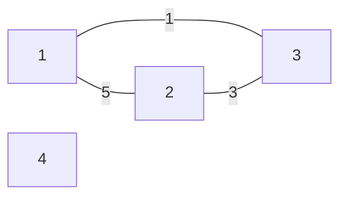
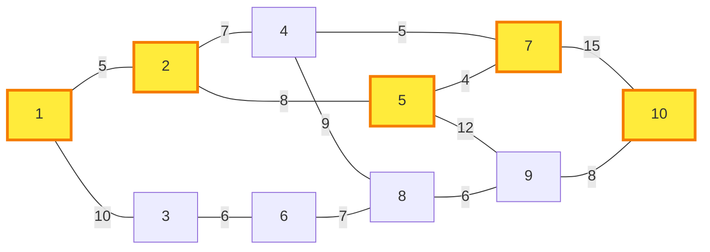
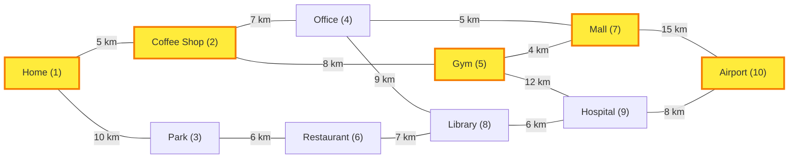
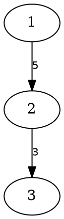

# Yog 🌳

[](https://hex.pm/packages/yog)
[](https://hexdocs.pm/yog/)

A graph algorithm library for Gleam, providing implementations of classic graph algorithms with a functional API.

## Features

- **Graph Data Structures**: Directed and undirected graphs with generic node and edge data
- **Pathfinding Algorithms**:
  - Dijkstra's shortest path (non-negative weights)
  - A* search with heuristics
  - Bellman-Ford (supports negative weights, detects cycles)
  - Floyd-Warshall (all-pairs shortest paths)
- **Graph Traversal**: BFS and DFS with early termination support
- **Graph Transformations**: Transpose (O(1)!), map nodes/edges, filter, merge, subgraph extraction, edge contraction
- **Graph Visualization**: Mermaid, DOT (Graphviz), and JSON rendering with path highlighting
- **Minimum Spanning Tree**: Kruskal's algorithm with Union-Find
- **Minimum Cut**: Stoer-Wagner algorithm for global minimum cut (perfect for AoC 2023 Day 25)
- **Topological Sorting**: Kahn's algorithm with lexicographical variant
- **Strongly Connected Components**: Tarjan's algorithm
- **Graph Connectivity**: Bridge and articulation point detection (Tarjan's algorithm)
- **Eulerian Paths & Circuits**: Detection and finding using Hierholzer's algorithm (perfect for route planning and traversal problems)
- **Bipartite Graphs**: Detection (2-coloring) and maximum matching (augmenting path algorithm)
- **Disjoint Set (Union-Find)**: Public API with path compression and union by rank for dynamic connectivity
- **Efficient Data Structures**: Pairing heap for priority queues

## Installation

Add Yog to your Gleam project:

```sh
gleam add yog
```

## Quick Start

```gleam
import gleam/int
import gleam/io
import gleam/option.{None, Some}
import yog
import yog/pathfinding

pub fn main() {
  // Create a directed graph
  let graph =
    yog.directed()
    |> yog.add_node(1, "Start")
    |> yog.add_node(2, "Middle")
    |> yog.add_node(3, "End")
    |> yog.add_edge(from: 1, to: 2, with: 5)
    |> yog.add_edge(from: 2, to: 3, with: 3)
    |> yog.add_edge(from: 1, to: 3, with: 10)

  // Find shortest path
  case pathfinding.shortest_path(
    in: graph,
    from: 1,
    to: 3,
    with_zero: 0,
    with_add: int.add,
    with_compare: int.compare
  ) {
    Some(path) -> {
      // Path(nodes: [1, 2, 3], total_weight: 8)
      // Outputs: Found path with weight: 8
      io.println("Found path with weight: " <> int.to_string(path.total_weight))
    }
    None -> io.println("No path found")
  }
}
```

## API Overview

### Core Graph Operations

The `yog` module provides convenient functions for graph operations:

```gleam
import yog

// Create graphs
let graph = yog.directed()  // or yog.undirected()

// Add nodes with data
|> yog.add_node(1, "Node A")
|> yog.add_node(2, "Node B")

// Add edges with weights
|> yog.add_edge(from: 1, to: 2, with: 10)

// Query the graph
let successors = yog.successors(graph, 1)        // Outgoing edges [#(2, 10)]
let predecessors = yog.predecessors(graph, 1)    // Incoming edges []
let neighbors = yog.neighbors(graph, 2)          // All connected nodes [#(1, 10)]
```

You can also use `yog/model` directly if you prefer:
```gleam
import yog/model.{Directed}
let graph = model.new(Directed)
```

### Building Graphs with Labels (`yog/builder/labeled`)

The core graph uses integer node IDs, but you can build graphs using strings or any other type as labels:

```gleam
import yog
import yog/builder/labeled

// Build a graph with string labels
let builder =
  labeled.directed()
  |> labeled.add_edge(from: "home", to: "work", with: 10)
  |> labeled.add_edge(from: "work", to: "gym", with: 5)
  |> labeled.add_edge(from: "home", to: "gym", with: 20)

// Convert to a Graph for use with algorithms
let graph = labeled.to_graph(builder)

// Get node IDs to use with algorithms
let assert Ok(home_id) = labeled.get_id(builder, "home")
let assert Ok(gym_id) = labeled.get_id(builder, "gym")

// Now use with any graph algorithm
pathfinding.shortest_path(
  in: graph,
  from: home_id,
  to: gym_id,
  with_zero: 0,
  with_add: int.add,
  with_compare: int.compare,
)

// You can also query by label
let assert Ok(work_connections) = labeled.successors(builder, "work")
// => [#("gym", 5)]
```

The builder automatically manages the mapping between labels and internal integer IDs, making it easy to work with naturally labeled data.

### Pathfinding (`yog/pathfinding`)

#### Dijkstra's Algorithm

Best for: Graphs with non-negative edge weights

```gleam
import yog/pathfinding

pathfinding.shortest_path(
  in: graph,
  from: start_node,
  to: goal_node,
  with_zero: 0,
  with_add: int.add,
  with_compare: int.compare
)
// => Some(Path([1, 2, 5], 15)) or None
```

**Time Complexity:** O((V + E) log V)

#### A* Search

Best for: When you have a good heuristic estimate of remaining distance

```gleam
// Define an admissible heuristic (must never overestimate)
let manhattan_distance = fn(node, goal) {
  int.absolute_value(node.x - goal.x) +
  int.absolute_value(node.y - goal.y)
}

pathfinding.a_star(
  in: graph,
  from: start,
  to: goal,
  with_zero: 0,
  with_add: int.add,
  with_compare: int.compare,
  heuristic: manhattan_distance
)
```

**Time Complexity:** O((V + E) log V), often faster than Dijkstra with good heuristics

#### Bellman-Ford Algorithm

Best for: Graphs with negative edge weights, or when detecting negative cycles

```gleam
case pathfinding.bellman_ford(
  in: graph,
  from: start,
  to: goal,
  with_zero: 0,
  with_add: int.add,
  with_compare: int.compare
) {
  ShortestPath(path) -> // Found valid path (may have negative total weight)
  NegativeCycle -> // Negative cycle detected
  NoPath -> // No path exists
}
```

**Time Complexity:** O(VE)

#### Single-Source Distances

Best for: Finding distances to multiple destinations, or finding the closest target among many options

```gleam
// Compute distances from source to all reachable nodes
let distances = pathfinding.single_source_distances(
  in: graph,
  from: start_node,
  with_zero: 0,
  with_add: int.add,
  with_compare: int.compare
)
// => dict.from_list([#(1, 0), #(2, 5), #(3, 8), #(4, 15)])

// Find closest target among multiple options
let targets = [10, 20, 30]
let closest = targets
  |> list.filter_map(fn(t) { dict.get(distances, t) })
  |> list.sort(int.compare)
  |> list.first
// => Ok(5)

// Combine with transform.transpose for reverse pathfinding
import yog/transform

let reversed = transform.transpose(graph)  // O(1) operation!
let distances_from_goal = pathfinding.single_source_distances(
  in: reversed,
  from: goal,
  with_zero: 0,
  with_add: int.add,
  with_compare: int.compare
)
// Now you have distances TO the goal FROM any node
```

**Time Complexity:** O((V + E) log V)

**Use Cases:**
- Finding nearest target among multiple options (e.g., nearest exit, closest resource)
- Computing distance maps for game AI
- Network routing table generation
- Reverse pathfinding with `transform.transpose`

#### Floyd-Warshall (All-Pairs Shortest Paths)

Best for: Computing shortest distances between all pairs of nodes, or when you need distance matrices

```gleam
import gleam/dict
import yog/pathfinding

// Compute shortest paths between all pairs of nodes
case pathfinding.floyd_warshall(
  in: graph,
  with_zero: 0,
  with_add: int.add,
  with_compare: int.compare
) {
  Ok(distances) -> {
    // Query distance from any node to any other node
    let assert Ok(row) = dict.get(distances, source_node)
    let assert Ok(dist) = dict.get(row, target_node)
    // Use dist...
  }
  Error(Nil) -> {
    // Negative cycle detected!
  }
}
```

**Time Complexity:** O(V³)
**Space Complexity:** O(V²)

**Features:**
- Computes shortest paths between all pairs of nodes in one operation
- Can handle negative edge weights
- Detects negative cycles
- Returns nested dictionary: `distances[i][j]` = shortest distance from node i to node j

**Use Cases:**
- Precomputing distance matrices for frequent queries
- Finding graph diameter (maximum shortest path)
- Transitive closure computation
- Network analysis (centrality measures)
- AoC problems requiring all-pairs distances (e.g., 2022 Day 16)

**When to use:**
- Use **Floyd-Warshall** when you need distances between many or all pairs of nodes
- Use **Dijkstra** or **single_source_distances** when you only need paths from one source
- For sparse graphs with few queries, multiple Dijkstra calls may be faster than one Floyd-Warshall

### Graph Traversal (`yog/traversal`)

```gleam
import yog/traversal.{BreadthFirst, DepthFirst}

// Full traversal
let start_node = 1

let visited = traversal.walk(
  from: start_node,
  in: graph,
  using: BreadthFirst  // or DepthFirst
)
// => [1, 2, 3]

// Early termination
let target = 2

let path_to_target = traversal.walk_until(
  from: start_node,
  in: graph,
  using: BreadthFirst,
  until: fn(node) { node == target }
)
// => [1, 2]
```

**Time Complexity:** O(V + E)

### Minimum Spanning Tree (`yog/mst`)

Kruskal's algorithm finds the minimum spanning tree using Union-Find.

```gleam
import yog/mst

let mst_edges = mst.kruskal(
  in: graph,
  with_compare: int.compare
)
// => [Edge(2, 3, 3), Edge(1, 2, 5)]
```

**Time Complexity:** O(E log E)

### Eulerian Paths & Circuits (`yog/eulerian`)

Detect and find Eulerian paths (visiting every edge exactly once) and circuits using Hierholzer's algorithm.

```gleam
import yog/eulerian

// Check if a path exists
let has_path = eulerian.has_eulerian_path(graph)  // => True/False
let has_circuit = eulerian.has_eulerian_circuit(graph)  // => True/False

// Find the actual path
case eulerian.find_eulerian_path(graph) {
  Some(path) -> io.println("Eulerian path: " <> string.inspect(path))
  None -> io.println("No Eulerian path exists")
}
// => Some([1, 2, 3, 4, 1, 5])

// Find a circuit (starts and ends at same vertex)
case eulerian.find_eulerian_circuit(graph) {
  Some(circuit) -> io.println("Eulerian circuit: " <> string.inspect(circuit))
  None -> io.println("No Eulerian circuit exists")
}
// => Some([1, 2, 3, 1])
```

**Conditions:**
- **Circuit (undirected):** All vertices have even degree, graph is connected
- **Circuit (directed):** All vertices have equal in/out-degree, graph is connected
- **Path (undirected):** Exactly 0 or 2 vertices with odd degree, graph is connected
- **Path (directed):** At most one vertex with (out-degree > in-degree), one with (in-degree > out-degree)

**Time Complexity:**
- Detection: O(V + E)
- Finding: O(E)

**Use Cases:**
- Route planning (mail delivery, snow plowing)
- DNA sequence reconstruction
- Circuit design
- Puzzle solving (Seven Bridges of Königsberg)
- Network traversal problems

### Bipartite Graphs (`yog/bipartite`)

Detect bipartite graphs (2-colorable) and find maximum matchings using augmenting path algorithm.

```gleam
import yog/bipartite

// Check if graph is bipartite
let is_bipartite = bipartite.is_bipartite(graph)  // => True/False

// Get the two partitions (independent sets)
case bipartite.partition(graph) {
  Some(bipartite.Partition(left, right)) -> {
    // left and right are Sets of NodeIds
    io.println("Graph is bipartite!")
  }
  None -> io.println("Not bipartite")
}

// Find maximum matching
case bipartite.partition(graph) {
  Some(p) -> {
    let matching = bipartite.maximum_matching(graph, p)
    // => [#(1, 3), #(2, 4)] - list of matched pairs
    io.println("Matching size: " <> int.to_string(list.length(matching)))
  }
  None -> io.println("Not bipartite")
}
```

**Bipartite Graph:**
A graph is bipartite if its vertices can be divided into two disjoint sets such that every edge connects a vertex from one set to a vertex in the other. Equivalently, it's 2-colorable (no odd cycles).

**Maximum Matching:**
A matching is a set of edges with no common vertices. Maximum matching finds the largest possible matching.

**Time Complexity:**
- Detection & Partitioning: O(V + E)
- Maximum Matching: O(V * E)

**Use Cases:**
- Job assignment problems (workers to tasks)
- Stable matching (hospitals to residents)
- Timetable scheduling
- Resource allocation
- Network flow problems
- Hall's marriage theorem applications

### Disjoint Set / Union-Find (`yog/disjoint_set`)

A fundamental data structure for tracking disjoint sets with near-constant time operations. Uses path compression and union by rank for optimal performance.

```gleam
import yog/disjoint_set

// Build from pairs (common for edge lists, AoC problems)
let ds = disjoint_set.from_pairs([
  #(1, 2), #(3, 4), #(5, 6),  // Three separate components
])

// Check connectivity
let #(ds1, is_connected) = disjoint_set.connected(ds, 1, 2)  // => True
let #(ds2, is_connected) = disjoint_set.connected(ds1, 1, 3) // => False

// Query structure
disjoint_set.size(ds2)        // => 6 elements
disjoint_set.count_sets(ds2)  // => 3 sets

// Merge components
let ds3 = disjoint_set.union(ds2, 2, 3)
disjoint_set.count_sets(ds3)  // => 2 sets

// Extract final groupings
disjoint_set.to_lists(ds3)
// => [[1, 2, 3, 4], [5, 6]] (order may vary)
```

**Core Operations:**
- `new()`, `add()`, `find()`, `union()` - Basic operations

**Convenience Functions:**
- `from_pairs()` - Build from list of pairs (perfect for edge lists)
- `connected()` - Check if two elements are in the same set
- `size()` - Total number of elements
- `count_sets()` - Number of distinct sets
- `to_lists()` - Extract all sets as list of lists

**Time Complexity:** O(α(n)) amortized per operation, where α is the inverse Ackermann function (practically constant)

**Use Cases:**
- Dynamic connectivity queries
- Kruskal's MST algorithm
- Image segmentation (connected components)
- Network connectivity analysis
- Percolation problems
- Maze generation
- Game development (collision groups)

### Minimum Cut (`yog/min_cut`)

Finds the global minimum cut in an undirected weighted graph using the Stoer-Wagner algorithm. Returns the minimum cut weight and partition sizes—perfect for AoC 2023 Day 25!

```gleam
import yog/min_cut

let graph =
  yog.undirected()
  |> yog.add_node(1, Nil)
  |> yog.add_node(2, Nil)
  |> yog.add_node(3, Nil)
  |> yog.add_node(4, Nil)
  |> yog.add_edge(from: 1, to: 2, with: 1)
  |> yog.add_edge(from: 2, to: 3, with: 1)
  |> yog.add_edge(from: 3, to: 4, with: 10)
  |> yog.add_edge(from: 4, to: 1, with: 10)

let result = min_cut.global_min_cut(in: graph)
// Result: MinCut(weight: _, group_a_size: 1, group_b_size: 3)
// For AoC 2023 Day 25: group_a_size * group_b_size = answer
```

**Time Complexity:** O(V³) or O(VE + V² log V) with priority queue optimization

### Topological Sort (`yog/topological_sort`)

Orders nodes such that for every edge (u, v), u comes before v.

```gleam
import yog/topological_sort

// Standard topological sort
case topological_sort.topological_sort(graph) {
  Ok(ordering) -> // [1, 2, 3]
  Error(Nil) -> // Cycle detected
}

// Lexicographically smallest ordering
case topological_sort.lexicographical_topological_sort(graph, int.compare) {
  Ok(ordering) -> // Always picks smallest available node
  Error(Nil) -> // Cycle detected
}
```

**Time Complexity:**

- Standard: O(V + E)
- Lexicographical: O(V log V + E)

### Strongly Connected Components (`yog/components`)

Finds maximal strongly connected subgraphs using Tarjan's algorithm.

```gleam
import yog/components

let sccs = components.strongly_connected_components(graph)
// => [[1, 2, 3], [4], [5, 6]]
```

**Time Complexity:** O(V + E)

### Graph Connectivity (`yog/connectivity`)

Finds bridges (critical edges) and articulation points (cut vertices) in undirected graphs.

```gleam
import yog/connectivity

let results = connectivity.analyze(in: graph)

// Bridges: edges whose removal disconnects the graph
results.bridges
// => [#(1, 2), #(3, 4)]

// Articulation points: nodes whose removal disconnects the graph
results.articulation_points
// => [2, 3]
```

**Bridges** are edges whose removal increases the number of connected components. **Articulation points** (cut vertices) are nodes whose removal increases the number of connected components.

**Use Cases:**
- Network vulnerability analysis (identifying critical connections)
- Finding weaknesses in road/communication networks
- Circuit design (detecting single points of failure)
- Social network analysis (identifying key connectors)

**Time Complexity:** O(V + E)

### Graph Transformations (`yog/transform`)

Functional operations for transforming and manipulating graphs.

#### Transpose (O(1) Reverse All Edges!)

```gleam
import yog/transform

// Reverse all edges in constant time!
let reversed = transform.transpose(graph)
// Due to dual-map representation, this is just a pointer swap
```

**Time Complexity:** O(1) - dramatically faster than typical O(E) implementations

**Use for:** Kosaraju's SCC, finding nodes that can reach a target, reversing dependencies

#### Map Operations (Functor)

```gleam
// Transform node data
let uppercased = transform.map_nodes(graph, string.uppercase)

// Transform edge weights
let doubled_weights = transform.map_edges(graph, fn(w) { w * 2 })

// Can change types
let float_graph = transform.map_edges(int_graph, int.to_float)
```

**Time Complexity:**

- `map_nodes`: O(V)
- `map_edges`: O(E)

#### Filter Nodes (with Auto-Pruning)

```gleam
// Keep only nodes matching predicate
// Automatically removes edges to/from filtered nodes
let filtered = transform.filter_nodes(graph, fn(node_data) {
  string.starts_with(node_data, "active_")
})
```

**Time Complexity:** O(V + E)

#### Merge Graphs

```gleam
// Combine two graphs (second takes precedence on conflicts)
let combined = transform.merge(graph1, graph2)
```

**Time Complexity:** O(V + E)

**Use for:** Building graphs incrementally, applying patches/updates

#### Extract Subgraphs

```gleam
// Extract only specific nodes and their connecting edges
let sub = transform.subgraph(graph, keeping: [2, 3, 5, 7])
```

**Time Complexity:** O(V + E)

**Use for:** Extracting connected components, analyzing neighborhoods, working with algorithm results (SCCs, cliques)

#### Edge Contraction

```gleam
// Contract edge by merging node b into node a
let contracted = transform.contract(
  in: graph,
  merge: a,
  with: b,
  combine_weights: int.add
)
```

**Time Complexity:** O(deg(a) + deg(b))

**Use for:** Stoer-Wagner min-cut, Karger's algorithm, graph simplification, community detection

### Graph Visualization (`yog/render`)

Generate Mermaid diagrams for documentation, debugging, and presentations.

#### Basic Mermaid Generation

```gleam
import gleam/io
import yog/model
import yog/render

pub fn main() {
  let graph =
    model.new(model.Undirected)
    |> model.add_node(1, "Start")
    |> model.add_node(2, "Process")
    |> model.add_node(3, "End")
    |> model.add_node(4, "ForeverAlone")
    |> model.add_edge(from: 1, to: 2, with: "5")
    |> model.add_edge(from: 2, to: 3, with: "3")
    |> model.add_edge(from: 1, to: 3, with: "1")

  let diagram = render.to_mermaid(graph, render.default_options())
  io.println(diagram)
}
```

This outputs:



**Renders on GitHub/GitLab** - No external tools needed!

#### Highlight Paths

Perfect for visualizing algorithm results:

```gleam
import gleam/int
import gleam/io
import gleam/option
import gleam/string
import yog/model
import yog/pathfinding
import yog/render
import yog/transform

pub fn main() {
  // Build a city road network (10 locations)
  let graph =
    model.new(model.Undirected)
    |> model.add_node(1, "Home")
    |> model.add_node(2, "Coffee Shop")
    |> model.add_node(3, "Park")
    |> model.add_node(4, "Office")
    |> model.add_node(5, "Gym")
    |> model.add_node(6, "Restaurant")
    |> model.add_node(7, "Mall")
    |> model.add_node(8, "Library")
    |> model.add_node(9, "Hospital")
    |> model.add_node(10, "Airport")
    // Add roads with distances (in minutes)
    |> model.add_edge(from: 1, to: 2, with: 5)
    |> model.add_edge(from: 1, to: 3, with: 10)
    |> model.add_edge(from: 2, to: 4, with: 7)
    |> model.add_edge(from: 2, to: 5, with: 8)
    |> model.add_edge(from: 3, to: 6, with: 6)
    |> model.add_edge(from: 4, to: 7, with: 5)
    |> model.add_edge(from: 4, to: 8, with: 9)
    |> model.add_edge(from: 5, to: 7, with: 4)
    |> model.add_edge(from: 5, to: 9, with: 12)
    |> model.add_edge(from: 6, to: 8, with: 7)
    |> model.add_edge(from: 7, to: 10, with: 15)
    |> model.add_edge(from: 8, to: 9, with: 6)
    |> model.add_edge(from: 9, to: 10, with: 8)

  io.println("=== City Navigation System ===\n")

  // Find shortest path from Home (1) to Airport (10)
  let result =
    pathfinding.shortest_path(
      in: graph,
      from: 1,
      to: 10,
      with_zero: 0,
      with_add: int.add,
      with_compare: int.compare,
    )

  case result {
    option.Some(path) -> {
      io.println(
        "Shortest route from Home to Airport: "
        <> int.to_string(path.total_weight)
        <> " minutes",
      )
      io.println("Route: " <> string.inspect(path.nodes))
      io.println("\n=== Map Visualization ===\n")

      // Convert graph to string weights for rendering
      let graph_for_render =
        graph
        |> transform.map_edges(int.to_string)

      // Show full map without highlighting
      let full_map =
        render.to_mermaid(graph_for_render, render.default_options())
      io.println("Full city map:")
      io.println("```mermaid")
      io.println(full_map)
      io.println("```\n")

      // Show map with shortest path highlighted
      let highlighted_options =
        render.path_to_options(path, render.default_options())
      let highlighted_map =
        render.to_mermaid(graph_for_render, highlighted_options)

      io.println("Shortest path highlighted:")
      io.println("```mermaid")
      io.println(highlighted_map)
      io.println("```")
    }
    option.None -> io.println("No route found!")
  }
}
```

This outputs:



#### Custom Labels

If we added the following `options` to the graph in the previous example like the following:

```gleam
let options = render.MermaidOptions(
  node_label: fn(id, data) { data <> " (" <> int.to_string(id) <> ")" },
  edge_label: fn(weight) { weight <> " km" },
  highlighted_nodes: None,
  highlighted_edges: None,
)

let diagram = render.to_mermaid(graph, options)
```

Then we will see the following mermaid generated:



**Time Complexity:** O(V + E)

**Use for:** Documentation, debugging, presentations, teaching algorithms

#### DOT (Graphviz) Rendering

Generate DOT format diagrams that can be rendered with Graphviz tools.

```gleam
import gleam/io
import yog/model
import yog/render

pub fn main() {
  let graph =
    model.new(model.Directed)
    |> model.add_node(1, "Start")
    |> model.add_node(2, "Process")
    |> model.add_node(3, "End")
    |> model.add_edge(from: 1, to: 2, with: "5")
    |> model.add_edge(from: 2, to: 3, with: "3")

  let diagram = render.to_dot(graph, render.default_dot_options())
  io.println(diagram)
}
```

This outputs:



You can render this with Graphviz:

```sh
gleam run | dot -Tpng -o graph.png
gleam run | dot -Tsvg -o graph.svg
```

**Custom DOT Options:**

```gleam
let options = render.DotOptions(
  node_label: fn(id, data) { data },
  edge_label: fn(weight) { weight <> " km" },
  highlighted_nodes: None,
  highlighted_edges: None,
  node_shape: "box",        // "circle", "ellipse", "box", etc.
  highlight_color: "blue",   // Color for highlighted elements
)

let diagram = render.to_dot(graph, options)
```

**Highlight Paths with DOT:**

```gleam
case pathfinding.shortest_path(
  in: graph,
  from: 1,
  to: 3,
  with_zero: 0,
  with_add: int.add,
  with_compare: int.compare,
) {
  Some(path) -> {
    let options = render.path_to_dot_options(path, render.default_dot_options())
    let diagram = render.to_dot(graph_for_render, options)
    io.println(diagram)
  }
  None -> io.println("No path found")
}
```

**Time Complexity:** O(V + E)

**Use for:** Publication-quality graphics, scientific papers, generating PNG/SVG/PDF output

#### JSON Rendering

Export graphs as JSON for web-based visualization libraries like D3.js, Cytoscape.js, or Vis.js.

```gleam
import gleam/io
import yog/model
import yog/render

pub fn main() {
  let graph =
    model.new(model.Directed)
    |> model.add_node(1, "Alice")
    |> model.add_node(2, "Bob")
    |> model.add_node(3, "Carol")
    |> model.add_edge(from: 1, to: 2, with: "follows")
    |> model.add_edge(from: 2, to: 3, with: "follows")

  let json_string = render.to_json(graph, render.default_json_options())
  io.println(json_string)
}
```

This outputs:

```json
{
  "nodes": [
    {"id": 1, "label": "Alice"},
    {"id": 2, "label": "Bob"},
    {"id": 3, "label": "Carol"}
  ],
  "edges": [
    {"source": 1, "target": 2, "weight": "follows"},
    {"source": 2, "target": 3, "weight": "follows"}
  ]
}
```

**Custom JSON Mappers:**

```gleam
import gleam/json

let options = render.JsonOptions(
  node_mapper: fn(id, data) {
    json.object([
      #("id", json.int(id)),
      #("name", json.string(data)),
      #("group", json.int(1)),
    ])
  },
  edge_mapper: fn(from, to, weight) {
    json.object([
      #("source", json.int(from)),
      #("target", json.int(to)),
      #("value", json.int(5)),
      #("label", json.string(weight)),
    ])
  },
)

let json_string = render.to_json(graph, options)
```

This allows you to customize the JSON structure to match your visualization library's requirements.

**Example with D3.js Force Graph:**

```javascript
// In your web page
fetch('/api/graph')
  .then(response => response.json())
  .then(data => {
    const simulation = d3.forceSimulation(data.nodes)
      .force("link", d3.forceLink(data.edges).id(d => d.id))
      .force("charge", d3.forceManyBody())
      .force("center", d3.forceCenter(width / 2, height / 2));

    // Render your graph...
  });
```

**Time Complexity:** O(V + E)

**Use for:** Web applications, interactive visualizations, REST APIs, data export

## Working with Different Weight Types

Yog is generic over edge weights. You can use any type that supports addition and comparison:

### Integer Weights

```gleam
pathfinding.shortest_path(
  in: graph,
  from: 1, to: 5,
  with_zero: 0,
  with_add: int.add,
  with_compare: int.compare
)
```

### Float Weights

```gleam
pathfinding.shortest_path(
  in: graph,
  from: 1, to: 5,
  with_zero: 0.0,
  with_add: float.add,
  with_compare: float.compare
)
```

### Custom Weight Types

```gleam
pub type Distance {
  Distance(km: Float, time: Float)
}

let add_distances = fn(a, b) {
  Distance(km: a.km +. b.km, time: a.time +. b.time)
}

let compare_by_time = fn(a, b) {
  float.compare(a.time, b.time)
}

pathfinding.shortest_path(
  in: graph,
  from: 1, to: 5,
  with_zero: Distance(0.0, 0.0),
  with_add: add_distances,
  with_compare: compare_by_time
)
```

## Algorithm Selection Guide

| Algorithm | Use When | Time Complexity |
| ----------- | ---------- | ---------------- |
| **Dijkstra** | Non-negative weights, single shortest path | O((V+E) log V) |
| **A*** | Non-negative weights + good heuristic | O((V+E) log V)* |
| **Bellman-Ford** | Negative weights OR cycle detection needed | O(VE) |
| **Floyd-Warshall** | All-pairs shortest paths, distance matrices | O(V³) |
| **BFS/DFS** | Unweighted graphs, exploring reachability | O(V+E) |
| **Kruskal's MST** | Finding minimum spanning tree | O(E log E) |
| **Tarjan's SCC** | Finding strongly connected components | O(V+E) |
| **Tarjan's Connectivity** | Finding bridges and articulation points | O(V+E) |
| **Topological Sort** | Ordering tasks with dependencies | O(V+E) |

\* Often faster than Dijkstra in practice with good heuristics

## Examples

### Example 1: Social Network Analysis

```gleam
import yog/components
import yog/model.{Directed}

pub fn main() {
  // Model a social network where edges represent "follows" relationships
  let social_graph =
    model.new(Directed)
    |> model.add_node(1, "Alice")
    |> model.add_node(2, "Bob")
    |> model.add_node(3, "Carol")
    |> model.add_edge(from: 1, to: 2, with: Nil)
    |> model.add_edge(from: 2, to: 3, with: Nil)
    |> model.add_edge(from: 3, to: 1, with: Nil)

  // Find groups of mutually connected users
  let communities = components.strongly_connected_components(social_graph)
  echo communities
  // => [[1, 2, 3]]  // All three users form a strongly connected community
}
```

### Example 2: Task Scheduling

```gleam
import gleam/io
import gleam/string
import yog/model.{Directed}
import yog/topological_sort

pub fn main() {
  // Model tasks with dependencies
  let tasks =
    model.new(Directed)
    |> model.add_node(1, "Design")
    |> model.add_node(2, "Implement")
    |> model.add_node(3, "Test")
    |> model.add_node(4, "Deploy")
    |> model.add_edge(from: 1, to: 2, with: Nil)
    // Design before Implement
    |> model.add_edge(from: 2, to: 3, with: Nil)
    // Implement before Test
    |> model.add_edge(from: 3, to: 4, with: Nil)
  // Test before Deploy

  case topological_sort.topological_sort(tasks) {
    Ok(order) -> {
      // order = [1, 2, 3, 4] - valid execution order
      io.println("Execute tasks in order: " <> string.inspect(order))
    }
    Error(Nil) -> io.println("Circular dependency detected!")
  }
}
```

### Example 3: GPS Navigation

```gleam
import gleam/int
import gleam/io
import gleam/option.{None, Some}
import yog/model.{Undirected}
import yog/pathfinding

pub fn main() {
  // Model road network with travel times
  let road_network =
    model.new(Undirected)
    |> model.add_node(1, "Home")
    |> model.add_node(2, "Office")
    |> model.add_node(3, "Mall")
    |> model.add_edge(from: 1, to: 2, with: 15)
    // 15 minutes
    |> model.add_edge(from: 2, to: 3, with: 10)
    |> model.add_edge(from: 1, to: 3, with: 30)

  // Use A* with straight-line distance heuristic
  let straight_line_distance = fn(from, to) {
    // Simplified: in reality would use coordinates
    case from == to {
      True -> 0
      False -> 5
      // Optimistic estimate
    }
  }

  case
    pathfinding.a_star(
      in: road_network,
      from: 1,
      to: 3,
      with_zero: 0,
      with_add: int.add,
      with_compare: int.compare,
      heuristic: straight_line_distance,
    )
  {
    Some(path) -> {
      // Path(nodes: [1, 2, 3], total_weight: 25)
      // Prints: Fastest route takes 25 minutes
      io.println(
        "Fastest route takes " <> int.to_string(path.total_weight) <> " minutes",
      )
    }
    None -> io.println("No route found")
  }
}
```

### Example 4: Network Cable Layout (Minimum Spanning Tree)

```gleam
import gleam/int
import gleam/io
import gleam/list
import yog/model.{Undirected}
import yog/mst

pub fn main() {
  // Model buildings and cable costs
  let buildings =
    model.new(Undirected)
    |> model.add_node(1, "Building A")
    |> model.add_node(2, "Building B")
    |> model.add_node(3, "Building C")
    |> model.add_node(4, "Building D")
    |> model.add_edge(from: 1, to: 2, with: 100)
    // $100 to connect
    |> model.add_edge(from: 1, to: 3, with: 150)
    |> model.add_edge(from: 2, to: 3, with: 50)
    |> model.add_edge(from: 2, to: 4, with: 200)
    |> model.add_edge(from: 3, to: 4, with: 100)

  // Find minimum cost to connect all buildings
  let cables = mst.kruskal(in: buildings, with_compare: int.compare)
  let total_cost = list.fold(cables, 0, fn(sum, edge) { sum + edge.weight })
  // => 250 (connects all buildings with minimum cable cost)
  // Prints: Minimum cable cost is 250
  io.println("Minimum cable cost is " <> int.to_string(total_cost))
}
```

### Example 5: Cave Path Counting (DFS with Backtracking)

```gleam
import gleam/dict
import gleam/int
import gleam/io
import gleam/list
import gleam/set.{type Set}
import gleam/string
import yog/model.{type Graph}

pub fn main() {
  // Model a cave system with small and large caves
  // Small caves (lowercase) can only be visited once
  // Large caves (uppercase) can be visited multiple times
  let graph =
    model.new(model.Undirected)
    |> model.add_node(0, "start")
    |> model.add_node(1, "A")
    |> model.add_node(2, "b")
    |> model.add_node(3, "c")
    |> model.add_node(4, "d")
    |> model.add_node(5, "end")
    |> model.add_edge(from: 0, to: 1, with: Nil)
    |> model.add_edge(from: 0, to: 2, with: Nil)
    |> model.add_edge(from: 1, to: 3, with: Nil)
    |> model.add_edge(from: 1, to: 2, with: Nil)
    |> model.add_edge(from: 2, to: 4, with: Nil)
    |> model.add_edge(from: 1, to: 5, with: Nil)
    |> model.add_edge(from: 4, to: 5, with: Nil)

  // Custom DFS with backtracking to count all valid paths
  let paths = count_paths(graph, 0, set.new(), False)
  // Prints: Found 10 valid paths through the cave system
  io.println("Found " <> int.to_string(paths) <> " valid paths through the cave system")
}

fn count_paths(
  graph: Graph(String, Nil),
  current: Int,
  visited_small: Set(String),
  can_revisit_one: Bool,
) -> Int {
  let assert Ok(cave_name) = dict.get(graph.nodes, current)

  case cave_name {
    "end" -> 1  // Found a complete path
    _ -> {
      model.successors(graph, current)
      |> list.fold(0, fn(count, neighbor) {
        let #(neighbor_id, _) = neighbor
        let assert Ok(neighbor_name) = dict.get(graph.nodes, neighbor_id)

        let is_small = string.lowercase(neighbor_name) == neighbor_name
        let already_visited = set.contains(visited_small, neighbor_name)

        case neighbor_name, is_small, already_visited {
          "start", _, _ -> count  // Never revisit start
          _, False, _ -> {
            // Large cave - always allowed
            count + count_paths(graph, neighbor_id, visited_small, can_revisit_one)
          }
          _, True, False -> {
            // Small cave not yet visited
            let new_visited = set.insert(visited_small, neighbor_name)
            count + count_paths(graph, neighbor_id, new_visited, can_revisit_one)
          }
          _, True, True if can_revisit_one -> {
            // Small cave already visited, but we have a revisit token
            count + count_paths(graph, neighbor_id, visited_small, False)
          }
          _, True, True -> count  // Small cave already visited, no token
        }
      })
    }
  }
}
```

**Key Concepts:**
- **DFS with Backtracking**: Custom recursive traversal for path enumeration
- **Immutable State**: Using `Set` for visited tracking enables automatic backtracking
- **Revisit Token Pattern**: Elegantly handles complex visiting rules without branching explosion

### Example 6: Task Ordering with Dependencies (Lexicographical Topological Sort)

```gleam
import gleam/int
import gleam/io
import gleam/list
import gleam/string
import yog/model
import yog/topological_sort

pub fn main() {
  // Model task dependencies where we want alphabetically earliest valid order
  // Task B requires A to be completed first, etc.
  let dependencies = [
    #("C", "A"),  // C must be done before A
    #("C", "F"),  // C must be done before F
    #("A", "B"),  // A must be done before B
    #("A", "D"),  // A must be done before D
    #("B", "E"),  // B must be done before E
    #("D", "E"),  // D must be done before E
    #("F", "E"),  // F must be done before E
  ]

  // Use ASCII codes as node IDs so int.compare gives alphabetical order
  let graph =
    dependencies
    |> list.fold(model.new(model.Directed), fn(g, dep) {
      let #(prereq, step) = dep
      let prereq_id = char_to_ascii(prereq)
      let step_id = char_to_ascii(step)

      g
      |> model.add_node(prereq_id, prereq)
      |> model.add_node(step_id, step)
      |> model.add_edge(from: prereq_id, to: step_id, with: Nil)
    })

  case topological_sort.lexicographical_topological_sort(graph, int.compare) {
    Ok(order) -> {
      let task_order = order
        |> list.map(fn(id) {
          let assert Ok(task) = dict.get(graph.nodes, id)
          task
        })
        |> string.join("")

      // Prints: Task execution order: CABDFE
      io.println("Task execution order: " <> task_order)
    }
    Error(Nil) -> io.println("Circular dependency detected!")
  }
}

fn char_to_ascii(s: String) -> Int {
  let assert Ok(codepoint) = string.to_utf_codepoints(s) |> list.first
  string.utf_codepoint_to_int(codepoint)
}
```

**Key Concepts:**
- **Lexicographical Topological Sort**: Kahn's algorithm with priority queue for alphabetical ordering
- **ASCII Code Mapping**: Using character codes as node IDs enables `int.compare` to naturally sort alphabetically
- **Dependency Resolution**: Perfect for build systems, task schedulers, and prerequisite chains

## Projects Using Yog

Yog has been used to solve challenging problems from Advent of Code and other domains:

### Advent of Code Solutions

- **[2019 Day 6: Universal Orbit Map](https://github.com/code-shoily/aocgl/blob/main/src/year_2019/day_06.gleam)** - Orbital relationship analysis using labeled graphs, traversal, and shortest path algorithms to count orbits and find minimum orbital transfers

- **[2020 Day 7: Handy Haversacks](https://github.com/code-shoily/aocgl/blob/main/src/year_2020/day_07.gleam)** - Bag containment puzzle solved with labeled graphs, BFS traversal, and graph transposition (`transform.transpose`) to reverse containment relationships

- **[2021 Day 12: Passage Pathing](https://github.com/code-shoily/aocgl/blob/main/src/year_2021/day_12.gleam)** - Cave path enumeration using labeled graphs and custom DFS with backtracking to count all valid paths through small and large caves with complex visiting rules

- **[2018 Day 7: The Sum of Its Parts](https://github.com/code-shoily/aocgl/blob/main/src/year_2018/day_07.gleam)** - Task dependency resolution using lexicographical topological sort with ASCII code mapping for alphabetical ordering

- **[2022 Day 12: Hill Climbing Algorithm](https://github.com/code-shoily/aocgl/blob/main/src/year_2022/day_12.gleam)** - Heightmap pathfinding using the grid builder (`yog/builder/grid`), A* search, single-source distances, and graph transposition for reverse pathfinding

- **[2022 Day 16: Proboscidea Volcanium](https://github.com/code-shoily/aocgl/blob/main/src/year_2022/day_16.gleam)** - Valve network optimization using Floyd-Warshall for all-pairs shortest paths preprocessing, labeled graphs for parsing, and DFS with bitmask state tracking to maximize pressure release (single agent and two-agent variants)

*Have you used Yog in your project? [Open a PR](https://github.com/code-shoily/yog) to add it here!*

## Testing

Run the test suite:

```sh
gleam test
```

All 423 tests pass, covering:

- Graph construction and operations
- All pathfinding algorithms
- Traversal patterns
- Graph transformations
- Graph visualization
- MST, topological sort, and connectivity analysis
- Internal data structures (heap, union-find)

## Design Philosophy

Yog is designed with these principles:

1. **Functional and Immutable**: All operations return new graphs, no mutation
2. **Generic and Flexible**: Works with any weight type that supports addition and comparison
3. **Type-Safe**: Leverages Gleam's type system to prevent errors at compile time
4. **Well-Tested**: Comprehensive test suite with 423 tests
5. **Documented**: Every public function has documentation with examples
6. **Efficient**: Uses optimal algorithms and data structures (pairing heaps, union-find with path compression, O(1) transpose)

## Performance Characteristics

### Space Complexity

- Graph storage: O(V + E)
- Dijkstra/A*: O(V) for visited set and heap
- Bellman-Ford: O(V) for distances
- Union-Find: O(V)

### When to Use Each Algorithm

**Shortest Path:**

- Use **Dijkstra** for most cases with non-negative weights (single source)
- Use **A*** when you have a good heuristic (can be much faster)
- Use **Bellman-Ford** only when you have negative weights or need cycle detection
- Use **Floyd-Warshall** when you need distances between many or all pairs of nodes

**Traversal:**

- Use **BFS** for shortest path in unweighted graphs, level-order traversal
- Use **DFS** for exhaustive search, topological properties

**MST:**

- Use **Kruskal's** for sparse graphs or when edges are already sorted

## Development

```sh
gleam run   # Run the project
gleam test  # Run the tests
```

## Contributing

Contributions are welcome! Please ensure:

1. All tests pass (`gleam test`)
2. New features include tests
3. Public functions have documentation
4. Code follows the existing style

## About the Name

**Yog** (योग in Sanskrit, যোগ in Bangla) means "connection" or "union" in Sanskrit, and "addition" or "sum" in Bangla. Both meanings perfectly capture the essence of this library: graphs are fundamentally about **connections** between nodes, and building them involves continuously **adding** nodes and edges together. The name reflects the mathematical and philosophical concept of bringing elements together to form a connected whole.

## Acknowledgments

Yog implements classic algorithms from graph theory and computer science literature. I tried to keep the implementations optimized for Gleam's functional programming paradigm while maintaining algorithmic efficiency.

---

Further documentation can be found at <https://hexdocs.pm/yog>.

**Yog** - Graph algorithms for Gleam 🌳
