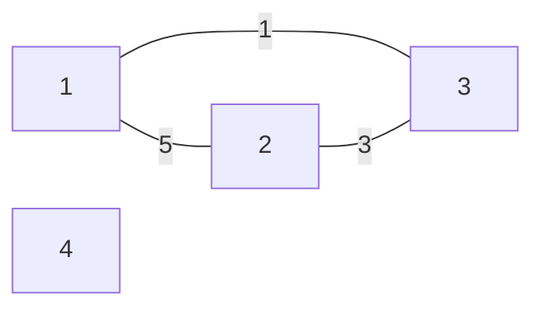
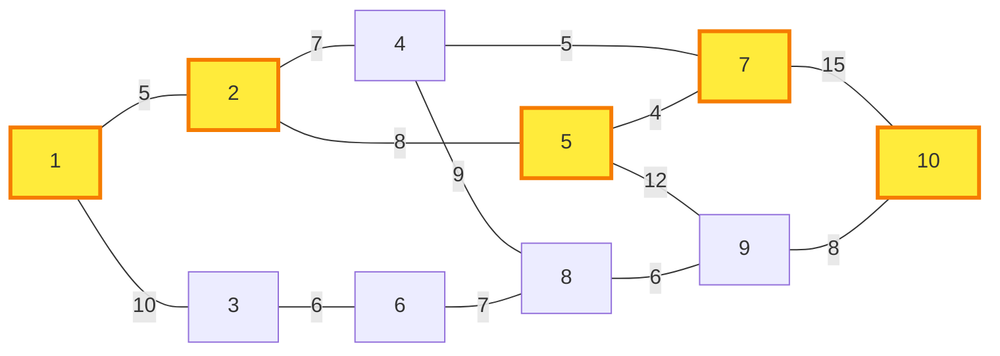
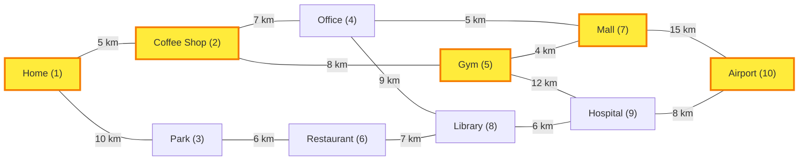
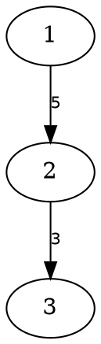

# Yog 🌳

[](https://hex.pm/packages/yog)
[](https://hexdocs.pm/yog/)

A graph algorithm library for Gleam, providing implementations of classic graph algorithms with a functional API.

## Features

- **Graph Data Structures**: Directed and undirected graphs with generic node and edge data
- **Pathfinding Algorithms**:
  - Dijkstra's shortest path (non-negative weights)
  - A* search with heuristics
  - Bellman-Ford (supports negative weights, detects cycles)
- **Graph Traversal**: BFS and DFS with early termination support
- **Graph Transformations**: Transpose (O(1)!), map nodes/edges, filter, merge
- **Graph Visualization**: Mermaid, DOT (Graphviz), and JSON rendering with path highlighting
- **Minimum Spanning Tree**: Kruskal's algorithm with Union-Find
- **Topological Sorting**: Kahn's algorithm with lexicographical variant
- **Strongly Connected Components**: Tarjan's algorithm
- **Efficient Data Structures**: Pairing heap for priority queues, Union-Find with path compression

## Installation

Add Yog to your Gleam project:

```sh
gleam add yog
```

## Quick Start

```gleam
import gleam/int
import gleam/io
import gleam/option.{None, Some}
import yog
import yog/pathfinding

pub fn main() {
  // Create a directed graph
  let graph =
    yog.directed()
    |> yog.add_node(1, "Start")
    |> yog.add_node(2, "Middle")
    |> yog.add_node(3, "End")
    |> yog.add_edge(from: 1, to: 2, with: 5)
    |> yog.add_edge(from: 2, to: 3, with: 3)
    |> yog.add_edge(from: 1, to: 3, with: 10)

  // Find shortest path
  case pathfinding.shortest_path(
    in: graph,
    from: 1,
    to: 3,
    with_zero: 0,
    with_add: int.add,
    with_compare: int.compare
  ) {
    Some(path) -> {
      // Path(nodes: [1, 2, 3], total_weight: 8)
      // Outputs: Found path with weight: 8
      io.println("Found path with weight: " <> int.to_string(path.total_weight))
    }
    None -> io.println("No path found")
  }
}
```

## API Overview

### Core Graph Operations

The `yog` module provides convenient functions for graph operations:

```gleam
import yog

// Create graphs
let graph = yog.directed()  // or yog.undirected()

// Add nodes with data
|> yog.add_node(1, "Node A")
|> yog.add_node(2, "Node B")

// Add edges with weights
|> yog.add_edge(from: 1, to: 2, with: 10)

// Query the graph
let successors = yog.successors(graph, 1)        // Outgoing edges [#(2, 10)]
let predecessors = yog.predecessors(graph, 1)    // Incoming edges []
let neighbors = yog.neighbors(graph, 2)          // All connected nodes [#(1, 10)]
```

You can also use `yog/model` directly if you prefer:
```gleam
import yog/model.{Directed}
let graph = model.new(Directed)
```

### Building Graphs with Labels (`yog/builder/labeled`)

The core graph uses integer node IDs, but you can build graphs using strings or any other type as labels:

```gleam
import yog
import yog/builder/labeled

// Build a graph with string labels
let builder =
  labeled.directed()
  |> labeled.add_edge(from: "home", to: "work", with: 10)
  |> labeled.add_edge(from: "work", to: "gym", with: 5)
  |> labeled.add_edge(from: "home", to: "gym", with: 20)

// Convert to a Graph for use with algorithms
let graph = labeled.to_graph(builder)

// Get node IDs to use with algorithms
let assert Ok(home_id) = labeled.get_id(builder, "home")
let assert Ok(gym_id) = labeled.get_id(builder, "gym")

// Now use with any graph algorithm
pathfinding.shortest_path(
  in: graph,
  from: home_id,
  to: gym_id,
  with_zero: 0,
  with_add: int.add,
  with_compare: int.compare,
)

// You can also query by label
let assert Ok(work_connections) = labeled.successors(builder, "work")
// => [#("gym", 5)]
```

The builder automatically manages the mapping between labels and internal integer IDs, making it easy to work with naturally labeled data.

### Pathfinding (`yog/pathfinding`)

#### Dijkstra's Algorithm

Best for: Graphs with non-negative edge weights

```gleam
import yog/pathfinding

pathfinding.shortest_path(
  in: graph,
  from: start_node,
  to: goal_node,
  with_zero: 0,
  with_add: int.add,
  with_compare: int.compare
)
// => Some(Path([1, 2, 5], 15)) or None
```

**Time Complexity:** O((V + E) log V)

#### A* Search

Best for: When you have a good heuristic estimate of remaining distance

```gleam
// Define an admissible heuristic (must never overestimate)
let manhattan_distance = fn(node, goal) {
  int.absolute_value(node.x - goal.x) +
  int.absolute_value(node.y - goal.y)
}

pathfinding.a_star(
  in: graph,
  from: start,
  to: goal,
  with_zero: 0,
  with_add: int.add,
  with_compare: int.compare,
  heuristic: manhattan_distance
)
```

**Time Complexity:** O((V + E) log V), often faster than Dijkstra with good heuristics

#### Bellman-Ford Algorithm

Best for: Graphs with negative edge weights, or when detecting negative cycles

```gleam
case pathfinding.bellman_ford(
  in: graph,
  from: start,
  to: goal,
  with_zero: 0,
  with_add: int.add,
  with_compare: int.compare
) {
  ShortestPath(path) -> // Found valid path (may have negative total weight)
  NegativeCycle -> // Negative cycle detected
  NoPath -> // No path exists
}
```

**Time Complexity:** O(VE)

#### Single-Source Distances

Best for: Finding distances to multiple destinations, or finding the closest target among many options

```gleam
// Compute distances from source to all reachable nodes
let distances = pathfinding.single_source_distances(
  in: graph,
  from: start_node,
  with_zero: 0,
  with_add: int.add,
  with_compare: int.compare
)
// => dict.from_list([#(1, 0), #(2, 5), #(3, 8), #(4, 15)])

// Find closest target among multiple options
let targets = [10, 20, 30]
let closest = targets
  |> list.filter_map(fn(t) { dict.get(distances, t) })
  |> list.sort(int.compare)
  |> list.first
// => Ok(5)

// Combine with transform.transpose for reverse pathfinding
import yog/transform

let reversed = transform.transpose(graph)  // O(1) operation!
let distances_from_goal = pathfinding.single_source_distances(
  in: reversed,
  from: goal,
  with_zero: 0,
  with_add: int.add,
  with_compare: int.compare
)
// Now you have distances TO the goal FROM any node
```

**Time Complexity:** O((V + E) log V)

**Use Cases:**
- Finding nearest target among multiple options (e.g., nearest exit, closest resource)
- Computing distance maps for game AI
- Network routing table generation
- Reverse pathfinding with `transform.transpose`

### Graph Traversal (`yog/traversal`)

```gleam
import yog/traversal.{BreadthFirst, DepthFirst}

// Full traversal
let start_node = 1

let visited = traversal.walk(
  from: start_node,
  in: graph,
  using: BreadthFirst  // or DepthFirst
)
// => [1, 2, 3]

// Early termination
let target = 2

let path_to_target = traversal.walk_until(
  from: start_node,
  in: graph,
  using: BreadthFirst,
  until: fn(node) { node == target }
)
// => [1, 2]
```

**Time Complexity:** O(V + E)

### Minimum Spanning Tree (`yog/mst`)

Kruskal's algorithm finds the minimum spanning tree using Union-Find.

```gleam
import yog/mst

let mst_edges = mst.kruskal(
  in: graph,
  with_compare: int.compare
)
// => [Edge(2, 3, 3), Edge(1, 2, 5)]
```

**Time Complexity:** O(E log E)

### Topological Sort (`yog/topological_sort`)

Orders nodes such that for every edge (u, v), u comes before v.

```gleam
import yog/topological_sort

// Standard topological sort
case topological_sort.topological_sort(graph) {
  Ok(ordering) -> // [1, 2, 3]
  Error(Nil) -> // Cycle detected
}

// Lexicographically smallest ordering
case topological_sort.lexicographical_topological_sort(graph, int.compare) {
  Ok(ordering) -> // Always picks smallest available node
  Error(Nil) -> // Cycle detected
}
```

**Time Complexity:**

- Standard: O(V + E)
- Lexicographical: O(V log V + E)

### Strongly Connected Components (`yog/components`)

Finds maximal strongly connected subgraphs using Tarjan's algorithm.

```gleam
import yog/components

let sccs = components.strongly_connected_components(graph)
// => [[1, 2, 3], [4], [5, 6]]
```

**Time Complexity:** O(V + E)

### Graph Transformations (`yog/transform`)

Functional operations for transforming and manipulating graphs.

#### Transpose (O(1) Reverse All Edges!)

```gleam
import yog/transform

// Reverse all edges in constant time!
let reversed = transform.transpose(graph)
// Due to dual-map representation, this is just a pointer swap
```

**Time Complexity:** O(1) - dramatically faster than typical O(E) implementations

**Use for:** Kosaraju's SCC, finding nodes that can reach a target, reversing dependencies

#### Map Operations (Functor)

```gleam
// Transform node data
let uppercased = transform.map_nodes(graph, string.uppercase)

// Transform edge weights
let doubled_weights = transform.map_edges(graph, fn(w) { w * 2 })

// Can change types
let float_graph = transform.map_edges(int_graph, int.to_float)
```

**Time Complexity:**

- `map_nodes`: O(V)
- `map_edges`: O(E)

#### Filter Nodes (with Auto-Pruning)

```gleam
// Keep only nodes matching predicate
// Automatically removes edges to/from filtered nodes
let filtered = transform.filter_nodes(graph, fn(node_data) {
  string.starts_with(node_data, "active_")
})
```

**Time Complexity:** O(V + E)

#### Merge Graphs

```gleam
// Combine two graphs (second takes precedence on conflicts)
let combined = transform.merge(graph1, graph2)
```

**Time Complexity:** O(V + E)

**Use for:** Building graphs incrementally, applying patches/updates

### Graph Visualization (`yog/render`)

Generate Mermaid diagrams for documentation, debugging, and presentations.

#### Basic Mermaid Generation

```gleam
import gleam/io
import yog/model
import yog/render

pub fn main() {
  let graph =
    model.new(model.Undirected)
    |> model.add_node(1, "Start")
    |> model.add_node(2, "Process")
    |> model.add_node(3, "End")
    |> model.add_node(4, "ForeverAlone")
    |> model.add_edge(from: 1, to: 2, with: "5")
    |> model.add_edge(from: 2, to: 3, with: "3")
    |> model.add_edge(from: 1, to: 3, with: "1")

  let diagram = render.to_mermaid(graph, render.default_options())
  io.println(diagram)
}
```

This outputs:



**Renders on GitHub/GitLab** - No external tools needed!

#### Highlight Paths

Perfect for visualizing algorithm results:

```gleam
import gleam/int
import gleam/io
import gleam/option
import gleam/string
import yog/model
import yog/pathfinding
import yog/render
import yog/transform

pub fn main() {
  // Build a city road network (10 locations)
  let graph =
    model.new(model.Undirected)
    |> model.add_node(1, "Home")
    |> model.add_node(2, "Coffee Shop")
    |> model.add_node(3, "Park")
    |> model.add_node(4, "Office")
    |> model.add_node(5, "Gym")
    |> model.add_node(6, "Restaurant")
    |> model.add_node(7, "Mall")
    |> model.add_node(8, "Library")
    |> model.add_node(9, "Hospital")
    |> model.add_node(10, "Airport")
    // Add roads with distances (in minutes)
    |> model.add_edge(from: 1, to: 2, with: 5)
    |> model.add_edge(from: 1, to: 3, with: 10)
    |> model.add_edge(from: 2, to: 4, with: 7)
    |> model.add_edge(from: 2, to: 5, with: 8)
    |> model.add_edge(from: 3, to: 6, with: 6)
    |> model.add_edge(from: 4, to: 7, with: 5)
    |> model.add_edge(from: 4, to: 8, with: 9)
    |> model.add_edge(from: 5, to: 7, with: 4)
    |> model.add_edge(from: 5, to: 9, with: 12)
    |> model.add_edge(from: 6, to: 8, with: 7)
    |> model.add_edge(from: 7, to: 10, with: 15)
    |> model.add_edge(from: 8, to: 9, with: 6)
    |> model.add_edge(from: 9, to: 10, with: 8)

  io.println("=== City Navigation System ===\n")

  // Find shortest path from Home (1) to Airport (10)
  let result =
    pathfinding.shortest_path(
      in: graph,
      from: 1,
      to: 10,
      with_zero: 0,
      with_add: int.add,
      with_compare: int.compare,
    )

  case result {
    option.Some(path) -> {
      io.println(
        "Shortest route from Home to Airport: "
        <> int.to_string(path.total_weight)
        <> " minutes",
      )
      io.println("Route: " <> string.inspect(path.nodes))
      io.println("\n=== Map Visualization ===\n")

      // Convert graph to string weights for rendering
      let graph_for_render =
        graph
        |> transform.map_edges(int.to_string)

      // Show full map without highlighting
      let full_map =
        render.to_mermaid(graph_for_render, render.default_options())
      io.println("Full city map:")
      io.println("```mermaid")
      io.println(full_map)
      io.println("```\n")

      // Show map with shortest path highlighted
      let highlighted_options =
        render.path_to_options(path, render.default_options())
      let highlighted_map =
        render.to_mermaid(graph_for_render, highlighted_options)

      io.println("Shortest path highlighted:")
      io.println("```mermaid")
      io.println(highlighted_map)
      io.println("```")
    }
    option.None -> io.println("No route found!")
  }
}
```

This outputs:



#### Custom Labels

If we added the following `options` to the graph in the previous example like the following:

```gleam
let options = render.MermaidOptions(
  node_label: fn(id, data) { data <> " (" <> int.to_string(id) <> ")" },
  edge_label: fn(weight) { weight <> " km" },
  highlighted_nodes: None,
  highlighted_edges: None,
)

let diagram = render.to_mermaid(graph, options)
```

Then we will see the following mermaid generated:



**Time Complexity:** O(V + E)

**Use for:** Documentation, debugging, presentations, teaching algorithms

#### DOT (Graphviz) Rendering

Generate DOT format diagrams that can be rendered with Graphviz tools.

```gleam
import gleam/io
import yog/model
import yog/render

pub fn main() {
  let graph =
    model.new(model.Directed)
    |> model.add_node(1, "Start")
    |> model.add_node(2, "Process")
    |> model.add_node(3, "End")
    |> model.add_edge(from: 1, to: 2, with: "5")
    |> model.add_edge(from: 2, to: 3, with: "3")

  let diagram = render.to_dot(graph, render.default_dot_options())
  io.println(diagram)
}
```

This outputs:



You can render this with Graphviz:

```sh
gleam run | dot -Tpng -o graph.png
gleam run | dot -Tsvg -o graph.svg
```

**Custom DOT Options:**

```gleam
let options = render.DotOptions(
  node_label: fn(id, data) { data },
  edge_label: fn(weight) { weight <> " km" },
  highlighted_nodes: None,
  highlighted_edges: None,
  node_shape: "box",        // "circle", "ellipse", "box", etc.
  highlight_color: "blue",   // Color for highlighted elements
)

let diagram = render.to_dot(graph, options)
```

**Highlight Paths with DOT:**

```gleam
case pathfinding.shortest_path(
  in: graph,
  from: 1,
  to: 3,
  with_zero: 0,
  with_add: int.add,
  with_compare: int.compare,
) {
  Some(path) -> {
    let options = render.path_to_dot_options(path, render.default_dot_options())
    let diagram = render.to_dot(graph_for_render, options)
    io.println(diagram)
  }
  None -> io.println("No path found")
}
```

**Time Complexity:** O(V + E)

**Use for:** Publication-quality graphics, scientific papers, generating PNG/SVG/PDF output

#### JSON Rendering

Export graphs as JSON for web-based visualization libraries like D3.js, Cytoscape.js, or Vis.js.

```gleam
import gleam/io
import yog/model
import yog/render

pub fn main() {
  let graph =
    model.new(model.Directed)
    |> model.add_node(1, "Alice")
    |> model.add_node(2, "Bob")
    |> model.add_node(3, "Carol")
    |> model.add_edge(from: 1, to: 2, with: "follows")
    |> model.add_edge(from: 2, to: 3, with: "follows")

  let json_string = render.to_json(graph, render.default_json_options())
  io.println(json_string)
}
```

This outputs:

```json
{
  "nodes": [
    {"id": 1, "label": "Alice"},
    {"id": 2, "label": "Bob"},
    {"id": 3, "label": "Carol"}
  ],
  "edges": [
    {"source": 1, "target": 2, "weight": "follows"},
    {"source": 2, "target": 3, "weight": "follows"}
  ]
}
```

**Custom JSON Mappers:**

```gleam
import gleam/json

let options = render.JsonOptions(
  node_mapper: fn(id, data) {
    json.object([
      #("id", json.int(id)),
      #("name", json.string(data)),
      #("group", json.int(1)),
    ])
  },
  edge_mapper: fn(from, to, weight) {
    json.object([
      #("source", json.int(from)),
      #("target", json.int(to)),
      #("value", json.int(5)),
      #("label", json.string(weight)),
    ])
  },
)

let json_string = render.to_json(graph, options)
```

This allows you to customize the JSON structure to match your visualization library's requirements.

**Example with D3.js Force Graph:**

```javascript
// In your web page
fetch('/api/graph')
  .then(response => response.json())
  .then(data => {
    const simulation = d3.forceSimulation(data.nodes)
      .force("link", d3.forceLink(data.edges).id(d => d.id))
      .force("charge", d3.forceManyBody())
      .force("center", d3.forceCenter(width / 2, height / 2));

    // Render your graph...
  });
```

**Time Complexity:** O(V + E)

**Use for:** Web applications, interactive visualizations, REST APIs, data export

## Working with Different Weight Types

Yog is generic over edge weights. You can use any type that supports addition and comparison:

### Integer Weights

```gleam
pathfinding.shortest_path(
  in: graph,
  from: 1, to: 5,
  with_zero: 0,
  with_add: int.add,
  with_compare: int.compare
)
```

### Float Weights

```gleam
pathfinding.shortest_path(
  in: graph,
  from: 1, to: 5,
  with_zero: 0.0,
  with_add: float.add,
  with_compare: float.compare
)
```

### Custom Weight Types

```gleam
pub type Distance {
  Distance(km: Float, time: Float)
}

let add_distances = fn(a, b) {
  Distance(km: a.km +. b.km, time: a.time +. b.time)
}

let compare_by_time = fn(a, b) {
  float.compare(a.time, b.time)
}

pathfinding.shortest_path(
  in: graph,
  from: 1, to: 5,
  with_zero: Distance(0.0, 0.0),
  with_add: add_distances,
  with_compare: compare_by_time
)
```

## Algorithm Selection Guide

| Algorithm | Use When | Time Complexity |
| ----------- | ---------- | ---------------- |
| **Dijkstra** | Non-negative weights, single shortest path | O((V+E) log V) |
| **A*** | Non-negative weights + good heuristic | O((V+E) log V)* |
| **Bellman-Ford** | Negative weights OR cycle detection needed | O(VE) |
| **BFS/DFS** | Unweighted graphs, exploring reachability | O(V+E) |
| **Kruskal's MST** | Finding minimum spanning tree | O(E log E) |
| **Tarjan's SCC** | Finding strongly connected components | O(V+E) |
| **Topological Sort** | Ordering tasks with dependencies | O(V+E) |

\* Often faster than Dijkstra in practice with good heuristics

## Examples

### Example 1: Social Network Analysis

```gleam
import yog/components
import yog/model.{Directed}

pub fn main() {
  // Model a social network where edges represent "follows" relationships
  let social_graph =
    model.new(Directed)
    |> model.add_node(1, "Alice")
    |> model.add_node(2, "Bob")
    |> model.add_node(3, "Carol")
    |> model.add_edge(from: 1, to: 2, with: Nil)
    |> model.add_edge(from: 2, to: 3, with: Nil)
    |> model.add_edge(from: 3, to: 1, with: Nil)

  // Find groups of mutually connected users
  let communities = components.strongly_connected_components(social_graph)
  echo communities
  // => [[1, 2, 3]]  // All three users form a strongly connected community
}
```

### Example 2: Task Scheduling

```gleam
import gleam/io
import gleam/string
import yog/model.{Directed}
import yog/topological_sort

pub fn main() {
  // Model tasks with dependencies
  let tasks =
    model.new(Directed)
    |> model.add_node(1, "Design")
    |> model.add_node(2, "Implement")
    |> model.add_node(3, "Test")
    |> model.add_node(4, "Deploy")
    |> model.add_edge(from: 1, to: 2, with: Nil)
    // Design before Implement
    |> model.add_edge(from: 2, to: 3, with: Nil)
    // Implement before Test
    |> model.add_edge(from: 3, to: 4, with: Nil)
  // Test before Deploy

  case topological_sort.topological_sort(tasks) {
    Ok(order) -> {
      // order = [1, 2, 3, 4] - valid execution order
      io.println("Execute tasks in order: " <> string.inspect(order))
    }
    Error(Nil) -> io.println("Circular dependency detected!")
  }
}
```

### Example 3: GPS Navigation

```gleam
import gleam/int
import gleam/io
import gleam/option.{None, Some}
import yog/model.{Undirected}
import yog/pathfinding

pub fn main() {
  // Model road network with travel times
  let road_network =
    model.new(Undirected)
    |> model.add_node(1, "Home")
    |> model.add_node(2, "Office")
    |> model.add_node(3, "Mall")
    |> model.add_edge(from: 1, to: 2, with: 15)
    // 15 minutes
    |> model.add_edge(from: 2, to: 3, with: 10)
    |> model.add_edge(from: 1, to: 3, with: 30)

  // Use A* with straight-line distance heuristic
  let straight_line_distance = fn(from, to) {
    // Simplified: in reality would use coordinates
    case from == to {
      True -> 0
      False -> 5
      // Optimistic estimate
    }
  }

  case
    pathfinding.a_star(
      in: road_network,
      from: 1,
      to: 3,
      with_zero: 0,
      with_add: int.add,
      with_compare: int.compare,
      heuristic: straight_line_distance,
    )
  {
    Some(path) -> {
      // Path(nodes: [1, 2, 3], total_weight: 25)
      // Prints: Fastest route takes 25 minutes
      io.println(
        "Fastest route takes " <> int.to_string(path.total_weight) <> " minutes",
      )
    }
    None -> io.println("No route found")
  }
}
```

### Example 4: Network Cable Layout (Minimum Spanning Tree)

```gleam
import gleam/int
import gleam/io
import gleam/list
import yog/model.{Undirected}
import yog/mst

pub fn main() {
  // Model buildings and cable costs
  let buildings =
    model.new(Undirected)
    |> model.add_node(1, "Building A")
    |> model.add_node(2, "Building B")
    |> model.add_node(3, "Building C")
    |> model.add_node(4, "Building D")
    |> model.add_edge(from: 1, to: 2, with: 100)
    // $100 to connect
    |> model.add_edge(from: 1, to: 3, with: 150)
    |> model.add_edge(from: 2, to: 3, with: 50)
    |> model.add_edge(from: 2, to: 4, with: 200)
    |> model.add_edge(from: 3, to: 4, with: 100)

  // Find minimum cost to connect all buildings
  let cables = mst.kruskal(in: buildings, with_compare: int.compare)
  let total_cost = list.fold(cables, 0, fn(sum, edge) { sum + edge.weight })
  // => 250 (connects all buildings with minimum cable cost)
  // Prints: Minimum cable cost is 250
  io.println("Minimum cable cost is " <> int.to_string(total_cost))
}
```

## Testing

Run the test suite:

```sh
gleam test
```

All 302 tests pass, covering:

- Graph construction and operations
- All pathfinding algorithms
- Traversal patterns
- Graph transformations
- Graph visualization
- MST and topological sort
- Internal data structures (heap, union-find)

## Design Philosophy

Yog is designed with these principles:

1. **Functional and Immutable**: All operations return new graphs, no mutation
2. **Generic and Flexible**: Works with any weight type that supports addition and comparison
3. **Type-Safe**: Leverages Gleam's type system to prevent errors at compile time
4. **Well-Tested**: Comprehensive test suite with 302 tests
5. **Documented**: Every public function has documentation with examples
6. **Efficient**: Uses optimal algorithms and data structures (pairing heaps, union-find with path compression, O(1) transpose)

## Performance Characteristics

### Space Complexity

- Graph storage: O(V + E)
- Dijkstra/A*: O(V) for visited set and heap
- Bellman-Ford: O(V) for distances
- Union-Find: O(V)

### When to Use Each Algorithm

**Shortest Path:**

- Use **Dijkstra** for most cases with non-negative weights
- Use **A*** when you have a good heuristic (can be much faster)
- Use **Bellman-Ford** only when you have negative weights or need cycle detection

**Traversal:**

- Use **BFS** for shortest path in unweighted graphs, level-order traversal
- Use **DFS** for exhaustive search, topological properties

**MST:**

- Use **Kruskal's** for sparse graphs or when edges are already sorted

## Development

```sh
gleam run   # Run the project
gleam test  # Run the tests
```

## Contributing

Contributions are welcome! Please ensure:

1. All tests pass (`gleam test`)
2. New features include tests
3. Public functions have documentation
4. Code follows the existing style

## About the Name

**Yog** (योग in Sanskrit, যোগ in Bangla) means "connection" or "union" in Sanskrit, and "addition" or "sum" in Bangla. Both meanings perfectly capture the essence of this library: graphs are fundamentally about **connections** between nodes, and building them involves continuously **adding** nodes and edges together. The name reflects the mathematical and philosophical concept of bringing elements together to form a connected whole.

## Acknowledgments

Yog implements classic algorithms from graph theory and computer science literature. I tried to keep the implementations optimized for Gleam's functional programming paradigm while maintaining algorithmic efficiency.

---

Further documentation can be found at <https://hexdocs.pm/yog>.

**Yog** - Graph algorithms for Gleam 🌳
